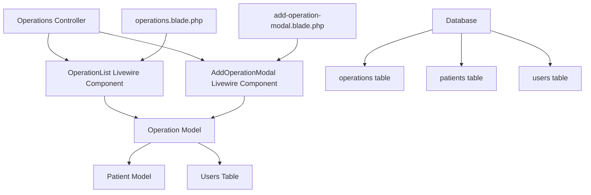

# Operation System Design Document

## 1. Overview

The Operation System is a comprehensive medical procedure management module for the klinikyazilim clinic management platform. It enables healthcare professionals to manage and track four main categories of medical procedures: Surgeries (Ameliyatlar), Mesotherapy (Mezoterapi), Botox treatments, and Filler procedures (Dolgu).

### Key Features
- Multi-category procedure management (Surgery, Mesotherapy, Botox, Filler)
- Patient selection from existing registered patients
- Automatic registration period assignment with manual override capability
- Role-based access control following existing system patterns
- Real-time procedure tracking and status management
- Comprehensive CRUD operations following Laravel Livewire patterns

## 2. Architecture

### 2.1 Technology Stack
- **Backend**: Laravel 12 with Livewire 3
- **Frontend**: Blade templates with Tailwind CSS
- **Database**: MySQL with InnoDB engine
- **Security**: Field-level encryption for sensitive data

### 2.2 System Components



### 2.3 Database Schema

#### Operations Table Structure
```sql
CREATE TABLE operations (
    id BIGINT UNSIGNED PRIMARY KEY AUTO_INCREMENT,
    patient_id BIGINT UNSIGNED NOT NULL,
    process ENUM('surgery', 'mesotherapy', 'botox', 'filler') NOT NULL,
    process_detail TEXT NOT NULL,
    process_date DATE NOT NULL,
    registration_period VARCHAR(7) NOT NULL, -- Format: MM.YYYY
    created_by BIGINT UNSIGNED NOT NULL,
    status ENUM('scheduled', 'in_progress', 'completed', 'cancelled') DEFAULT 'scheduled',
    estimated_duration INT, -- in minutes
    actual_duration INT, -- in minutes  
    notes TEXT,
    created_at TIMESTAMP DEFAULT CURRENT_TIMESTAMP,
    updated_at TIMESTAMP DEFAULT CURRENT_TIMESTAMP ON UPDATE CURRENT_TIMESTAMP,
    
    FOREIGN KEY (patient_id) REFERENCES patients(id) ON DELETE CASCADE,
    FOREIGN KEY (created_by) REFERENCES users(id) ON DELETE CASCADE,
    
    INDEX idx_patient_id (patient_id),
    INDEX idx_process (process),
    INDEX idx_process_date (process_date),
    INDEX idx_status (status),
    INDEX idx_registration_period (registration_period)
) ENGINE=InnoDB;
```

## 3. Component Architecture

### 3.1 OperationList Livewire Component

```php
class OperationList extends Component
{
    use HasPermissions;
    
    // Public Properties
    public $operations = [];
    public $patients = [];
    public $search = '';
    public $processFilter = 'all';
    public $statusFilter = 'all';
    public $registrationPeriodFilter = '';
    public $showModal = false;
    public $showDetailsModal = false;
    public $selectedOperation = null;
    
    // Statistics
    public $stats = [];
    
    // Pagination
    public $perPage = 10;
    
    protected $listeners = [
        'operation-created' => 'loadOperations',
        'operation-updated' => 'loadOperations',
        'refresh-operations' => 'loadOperations'
    ];
}
```

### 3.2 AddOperationModal Livewire Component

```php
class AddOperationModal extends Component
{
    use HasPermissions;
    
    // Modal State
    public $showModal = false;
    public $operationId = null;
    public $isEditMode = false;
    
    // Form Fields
    public $patient_id = '';
    public $process = '';
    public $process_detail = '';
    public $process_date = '';
    public $registration_period = '';
    public $estimated_duration = '';
    public $notes = '';
    
    // Helper Data
    public $patients = [];
    public $processTypes = [];
    
    protected function rules()
    {
        return [
            'patient_id' => 'required|exists:patients,id',
            'process' => 'required|in:surgery,mesotherapy,botox,filler',
            'process_detail' => 'required|string|max:500',
            'process_date' => 'required|date|after_or_equal:today',
            'registration_period' => 'required|regex:/^\d{2}\.\d{4}$/',
            'estimated_duration' => 'nullable|integer|min:15|max:480',
            'notes' => 'nullable|string|max:1000'
        ];
    }
}
```

## 4. Data Models

### 4.1 Operation Model

```php
class Operation extends Model
{
    use EncryptableFields;
    
    protected $fillable = [
        'patient_id',
        'process',
        'process_detail',
        'process_date',
        'registration_period',
        'created_by',
        'status',
        'estimated_duration',
        'actual_duration',
        'notes'
    ];
    
    protected $encryptable = [
        'process_detail',
        'notes'
    ];
    
    protected $casts = [
        'process_date' => 'date',
        'estimated_duration' => 'integer',
        'actual_duration' => 'integer'
    ];
    
    // Relationships
    public function patient(): BelongsTo
    {
        return $this->belongsTo(Patient::class);
    }
    
    public function creator(): BelongsTo
    {
        return $this->belongsTo(User::class, 'created_by');
    }
    
    // Scopes
    public function scopeByProcess($query, $process)
    {
        return $process !== 'all' ? $query->where('process', $process) : $query;
    }
    
    public function scopeByStatus($query, $status)
    {
        return $status !== 'all' ? $query->where('status', $status) : $query;
    }
    
    public function scopeByRegistrationPeriod($query, $period)
    {
        return $period ? $query->where('registration_period', $period) : $query;
    }
}
```

### 4.2 Model Relationships Enhancement

```php
// Patient Model Enhancement
class Patient extends Model
{
    // Existing code...
    
    public function operations(): HasMany
    {
        return $this->hasMany(Operation::class);
    }
    
    public function surgeries(): HasMany
    {
        return $this->hasMany(Operation::class)->where('process', 'surgery');
    }
    
    public function aestheticProcedures(): HasMany
    {
        return $this->hasMany(Operation::class)
            ->whereIn('process', ['mesotherapy', 'botox', 'filler']);
    }
}
```

## 5. User Interface Design

### 5.1 Main Operations Dashboard

#### Statistics Cards
- **This Month Operations**: Total count with growth percentage
- **Today's Scheduled**: Count of today's procedures with status indicator
- **Success Rate**: Overall success percentage
- **Average Duration**: Mean duration with trend indicator

#### Filter and Search Section
- **Search Bar**: Patient name, process type, or details
- **Process Filter**: All, Surgery, Mesotherapy, Botox, Filler
- **Status Filter**: All, Scheduled, In Progress, Completed, Cancelled
- **Registration Period Filter**: Auto-populated dropdown
- **Date Range Picker**: Custom date filtering
- **Add New Operation Button**: Primary action button

#### Operations Table
```html
<table class="min-w-full divide-y divide-gray-200">
    <thead class="bg-gray-50">
        <tr>
            <th>Patient & Procedure</th>
            <th>Date & Time</th>
            <th>Duration</th>
            <th>Status</th>
            <th>Registration Period</th>
            <th>Actions</th>
        </tr>
    </thead>
    <tbody>
        <!-- Dynamic rows with operation data -->
    </tbody>
</table>
```

### 5.2 Add/Edit Operation Modal

#### Form Sections
1. **Patient Selection**
   - Searchable dropdown from existing patients
   - Display patient info (name, age, phone)

2. **Procedure Details**
   - Process type selection (Surgery/Mesotherapy/Botox/Filler)
   - Detailed procedure description
   - Estimated duration

3. **Scheduling**
   - Procedure date picker
   - Registration period (auto-filled, editable)

4. **Additional Information**
   - Special notes or instructions
   - Priority level indicators

### 5.3 Process Type Specific Forms

#### Surgery Operations
- Pre-operative requirements
- Anesthesia type selection
- Operating room assignment
- Surgical team selection

#### Aesthetic Procedures (Mesotherapy/Botox/Filler)
- Treatment area specification
- Product details and quantities
- Session number (if part of series)
- Before/after photo requirements

## 6. Business Logic Layer

### 6.1 Registration Period Management

```php
class RegistrationPeriodService
{
    public static function getCurrentPeriod(): string
    {
        return Carbon::now()->format('m.Y');
    }
    
    public static function getAvailablePeriods(): array
    {
        $periods = [];
        $current = Carbon::now();
        
        // Previous 6 months
        for ($i = 6; $i >= 0; $i--) {
            $period = $current->copy()->subMonths($i);
            $periods[] = $period->format('m.Y');
        }
        
        // Next 6 months
        for ($i = 1; $i <= 6; $i++) {
            $period = $current->copy()->addMonths($i);
            $periods[] = $period->format('m.Y');
        }
        
        return $periods;
    }
}
```

### 6.2 Process Type Management

```php
class ProcessTypeService
{
    public static function getProcessTypes(): array
    {
        return [
            'surgery' => [
                'label' => 'Ameliyat',
                'icon' => 'fas fa-procedures',
                'color' => 'blue',
                'subcategories' => [
                    'rhinoplasty' => 'Burun Estetiği',
                    'breast_augmentation' => 'Göğüs Büyütme',
                    'liposuction' => 'Liposuction',
                    'facelift' => 'Yüz Germe'
                ]
            ],
            'mesotherapy' => [
                'label' => 'Mezoterapi',
                'icon' => 'fas fa-syringe',
                'color' => 'green',
                'subcategories' => [
                    'hair_mesotherapy' => 'Saç Mezoterapisi',
                    'skin_mesotherapy' => 'Cilt Mezoterapisi',
                    'cellulite_mesotherapy' => 'Selülit Mezoterapisi'
                ]
            ],
            'botox' => [
                'label' => 'Botoks',
                'icon' => 'fas fa-user-nurse',
                'color' => 'purple',
                'subcategories' => [
                    'forehead_botox' => 'Alın Botoksu',
                    'crow_feet_botox' => 'Göz Çevresi Botoksu',
                    'lip_botox' => 'Dudak Botoksu'
                ]
            ],
            'filler' => [
                'label' => 'Dolgu',
                'icon' => 'fas fa-fill-drip',
                'color' => 'yellow',
                'subcategories' => [
                    'lip_filler' => 'Dudak Dolgusu',
                    'cheek_filler' => 'Yanak Dolgusu',
                    'nose_filler' => 'Burun Dolgusu'
                ]
            ]
        ];
    }
}
```

### 6.3 Permission System

```php
trait OperationPermissions
{
    public function canCreateOperation(): bool
    {
        $user = auth()->user();
        return in_array($user->role, ['admin', 'doctor']);
    }
    
    public function canEditOperation(Operation $operation): bool
    {
        $user = auth()->user();
        
        if ($user->role === 'admin') {
            return true;
        }
        
        if ($user->role === 'doctor') {
            return $operation->created_by === $user->id;
        }
        
        return false;
    }
    
    public function canDeleteOperation(Operation $operation): bool
    {
        return $this->canEditOperation($operation) && 
               $operation->status === 'scheduled';
    }
    
    public function canViewOperation(Operation $operation): bool
    {
        $user = auth()->user();
        
        // All staff can view operations
        return in_array($user->role, ['admin', 'doctor', 'nurse', 'secretary']);
    }
    
    public function canUpdateStatus(Operation $operation): bool
    {
        $user = auth()->user();
        return in_array($user->role, ['admin', 'doctor', 'nurse']);
    }
}
```

## 7. CRUD Operations Implementation

### 7.1 Create Operation

```php
public function createOperation()
{
    $this->validate();
    
    if (!$this->canCreateOperation()) {
        session()->flash('error', 'Bu işlemi gerçekleştirme yetkiniz yok.');
        return;
    }
    
    $operation = Operation::create([
        'patient_id' => $this->patient_id,
        'process' => $this->process,
        'process_detail' => $this->process_detail,
        'process_date' => $this->process_date,
        'registration_period' => $this->registration_period,
        'created_by' => auth()->id(),
        'estimated_duration' => $this->estimated_duration,
        'notes' => $this->notes,
        'status' => 'scheduled'
    ]);
    
    // Create activity log
    Activity::create([
        'type' => 'operation_scheduled',
        'description' => "Yeni {$this->getProcessLabel()} planlandı: {$operation->patient->full_name}",
        'patient_id' => $this->patient_id
    ]);
    
    $this->resetForm();
    $this->showModal = false;
    $this->dispatch('operation-created');
    
    session()->flash('message', 'Operasyon başarıyla planlandı.');
}
```

### 7.2 Update Operation

```php
public function updateOperation()
{
    $this->validate();
    
    $operation = Operation::findOrFail($this->operationId);
    
    if (!$this->canEditOperation($operation)) {
        session()->flash('error', 'Bu operasyonu düzenleme yetkiniz yok.');
        return;
    }
    
    $operation->update([
        'patient_id' => $this->patient_id,
        'process' => $this->process,
        'process_detail' => $this->process_detail,
        'process_date' => $this->process_date,
        'registration_period' => $this->registration_period,
        'estimated_duration' => $this->estimated_duration,
        'notes' => $this->notes
    ]);
    
    Activity::create([
        'type' => 'operation_updated',
        'description' => "Operasyon güncellendi: {$operation->patient->full_name}",
        'patient_id' => $operation->patient_id
    ]);
    
    $this->resetEditForm();
    $this->dispatch('operation-updated');
    
    session()->flash('message', 'Operasyon başarıyla güncellendi.');
}
```

### 7.3 Delete Operation

```php
public function deleteOperation($operationId)
{
    $operation = Operation::findOrFail($operationId);
    
    if (!$this->canDeleteOperation($operation)) {
        session()->flash('error', 'Bu operasyonu silme yetkiniz yok.');
        return;
    }
    
    Activity::create([
        'type' => 'operation_deleted',
        'description' => "Operasyon silindi: {$operation->patient->full_name} - {$operation->process_detail}",
        'patient_id' => $operation->patient_id
    ]);
    
    $operation->delete();
    
    $this->loadOperations();
    session()->flash('message', 'Operasyon başarıyla silindi.');
}
```

### 7.4 Status Management

```php
public function updateOperationStatus($operationId, $newStatus)
{
    $operation = Operation::findOrFail($operationId);
    
    if (!$this->canUpdateStatus($operation)) {
        session()->flash('error', 'Operasyon durumunu değiştirme yetkiniz yok.');
        return;
    }
    
    $oldStatus = $operation->status;
    $operation->update(['status' => $newStatus]);
    
    // Handle status-specific logic
    switch ($newStatus) {
        case 'in_progress':
            $operation->update(['started_at' => now()]);
            break;
        case 'completed':
            $operation->update([
                'completed_at' => now(),
                'actual_duration' => $this->calculateDuration($operation)
            ]);
            break;
    }
    
    Activity::create([
        'type' => 'operation_status_changed',
        'description' => "Operasyon durumu '{$oldStatus}' dan '{$newStatus}' olarak değiştirildi: {$operation->patient->full_name}",
        'patient_id' => $operation->patient_id
    ]);
    
    $this->loadOperations();
    session()->flash('message', 'Operasyon durumu güncellendi.');
}
```

## 8. Testing Strategy

### 8.1 Unit Tests

```php
class OperationTest extends TestCase
{
    use RefreshDatabase;
    
    public function test_can_create_operation()
    {
        $doctor = User::factory()->create(['role' => 'doctor']);
        $patient = Patient::factory()->create();
        
        $this->actingAs($doctor);
        
        $operationData = [
            'patient_id' => $patient->id,
            'process' => 'surgery',
            'process_detail' => 'Burun Estetiği',
            'process_date' => now()->addDays(7)->format('Y-m-d'),
            'registration_period' => '08.2025'
        ];
        
        $operation = Operation::create($operationData + ['created_by' => $doctor->id]);
        
        $this->assertDatabaseHas('operations', $operationData);
    }
    
    public function test_cannot_create_operation_without_permission()
    {
        $secretary = User::factory()->create(['role' => 'secretary']);
        $this->actingAs($secretary);
        
        $component = Livewire::test(AddOperationModal::class);
        
        $this->assertFalse($component->instance()->canCreateOperation());
    }
}
```

### 8.2 Feature Tests

```php
class OperationManagementTest extends TestCase
{
    public function test_operations_page_displays_correctly()
    {
        $doctor = User::factory()->create(['role' => 'doctor']);
        $this->actingAs($doctor);
        
        Operation::factory()
            ->count(5)
            ->create();
        
        $response = $this->get('/operations');
        
        $response->assertStatus(200);
        $response->assertSee('Operasyonlar');
        $response->assertSee('Bu Ay Operasyon');
    }
    
    public function test_can_filter_operations_by_process_type()
    {
        $doctor = User::factory()->create(['role' => 'doctor']);
        $this->actingAs($doctor);
        
        Operation::factory()->create(['process' => 'surgery']);
        Operation::factory()->create(['process' => 'botox']);
        
        Livewire::test(OperationList::class)
            ->set('processFilter', 'surgery')
            ->assertSee('surgery')
            ->assertDontSee('botox');
    }
}
```